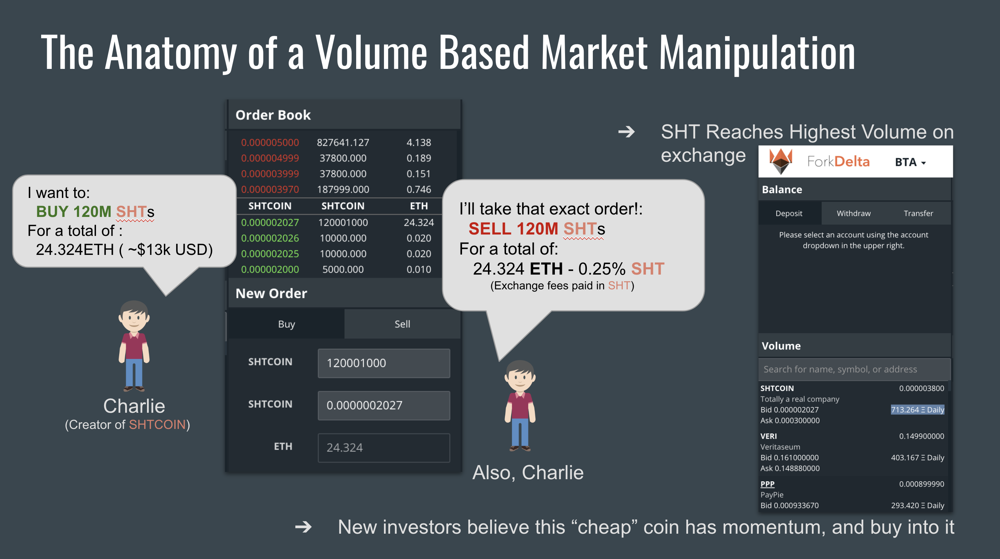
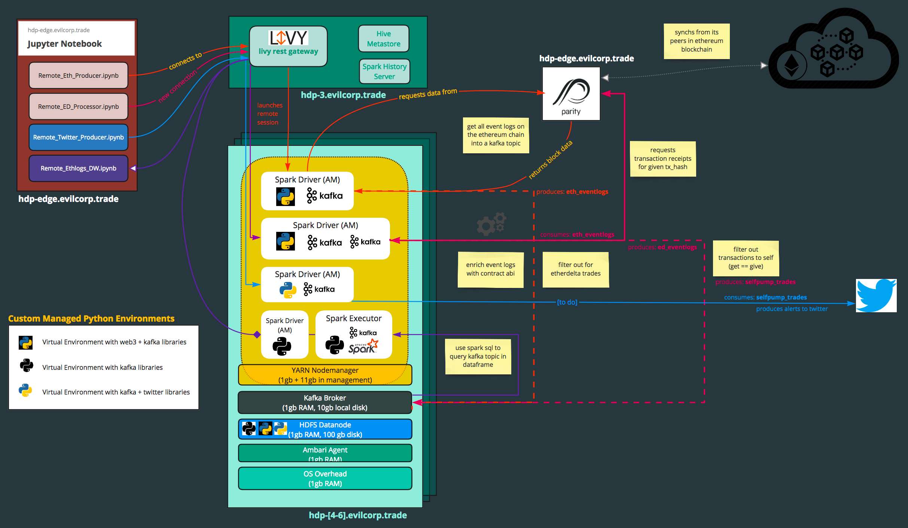

# DWSummit2018

https://dataworkssummit.com/san-jose-2018/session/detecting-real-time-market-manipulation-in-decentralized-cryptocurrency-exchanges/

A "decentralized exchange" is a currency exchange which lives and is run completely as a smart contract on the blockchain with no central authority or party running the backend. Funds are held in a smart contract and secured with a public/private key pair, such that each buy/sell/withdraw can only be invoked by the wallet owner and not by the central cluster admin.

The smart contract itself is run on the Ethereum Virtual Machine, which is comprised of hundreds of thousands of nodes that run independently on people's personal computers (and GPU farms!) but store every event on a public ledger. This enables a powerful platform for Investors, but also for money launderers, and "pump and dump" schemers.

For this demo, we will use popular data science tools to analyze EtherDelta's books—a cryptocurrency exchange with "over 1 billion USD" worth of funds in the "smart contract"—and leverage this publicly available dataset to expose which "coin" may be associated with artificial price manipulation as it happens in near real-time.

# Demo Notebooks:
- [Remote_Eth_Producer](./Remote_Eth_Producer.ipynb) - A kafka producer sending all Ethereum Transaction Logs to a topic as new blocks are added to the ethereum blokchain.
- [Remote_ED_Processor](./Remote_ED_Processor.ipynb)
-

---
## Prereqs

- [Local geth client](https://hub.docker.com/r/ethereum/client-go/), see [Intro to Web3](https://github.com/blockchain-demos/ethereum/tree/master/01_Intro_to_web3)
- Remote HDP Cluster
